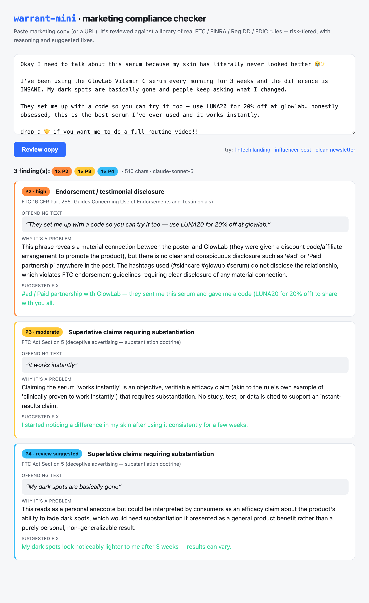
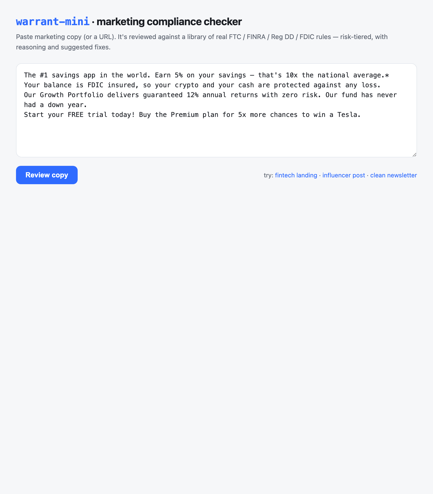

# warrant-mini

A miniature AI marketing-compliance checker. Give it marketing copy — pasted
text, a `.txt`/`.md` file, or a URL — and it reviews the copy against a small
library of real marketing-compliance rules, returning **risk-tiered findings**
with a reasoning trace and a suggested fix for each.

Inspired by what [Warrant](https://hellowarrant.com) does, built as a compact,
readable reference implementation.

```
 P1 · critical         Fair and balanced investment communications
 regulation  FINRA Rule 2210 (Communications with the Public)
 offending   “guaranteed 12% annual returns with zero risk”
 why         Promissory, guarantees future returns, and omits risk disclosure.
 fix         "Historically our Growth Portfolio has returned ~X%. All investing
             carries risk, including loss of principal; past performance does
             not guarantee future results."
```

The same review in the web UI:



---

## 60-second quickstart

```bash
# 1. install deps (uses uv)
uv sync

# 2. add your Anthropic API key
cp .env.example .env && $EDITOR .env       # or: export ANTHROPIC_API_KEY=sk-ant-...

# 3. review something
uv run warrant-mini check examples/fintech_landing.md      # planted violations
uv run warrant-mini check examples/clean_newsletter.md     # should stay quiet
uv run warrant-mini check examples/influencer_post.txt     # missing #ad disclosure

# other inputs
uv run warrant-mini check "Guaranteed 20% returns, FDIC insured!"   # literal text
uv run warrant-mini check https://example.com/landing-page          # a URL
uv run warrant-mini check examples/fintech_landing.md --json        # machine-readable

# see the rules it checks against
uv run warrant-mini rules

# or use the web UI
uv run warrant-mini serve            # → http://127.0.0.1:8000
```

Each finding carries a severity tier:

| Tier | Meaning |
|------|---------|
| **P1** | Critical — clear legal exposure (e.g. false "FDIC insured", guaranteed returns) |
| **P2** | High — e.g. missing required disclosure, undisclosed material connection |
| **P3** | Moderate — e.g. unsubstantiated superlative, buried disclaimer |
| **P4** | Review suggested — low-confidence / judgment call, flagged for a human |

---

## What it checks (the rule library)

Eight real rules, hardcoded in [`warrant_mini/rules.yaml`](warrant_mini/rules.yaml)
with citations, grouped for focused review passes:

| Group | Rules |
|-------|-------|
| **financial** | FINRA Rule 2210 (fair & balanced) · Reg DD / Truth in Savings (APY/APR accuracy) · FDIC/NCUA insured-claim accuracy |
| **claims** | FTC "free" + negative-option billing · superlative substantiation ("best"/"#1"/"guaranteed") · required-disclaimer proximity |
| **disclosure** | FTC 16 CFR Part 255 (endorsement / material-connection) · sweepstakes / contest disclosure |

Editing the rule set is a YAML change — no code.

---

## Architecture

```
input_loader → checker (per-group LLM judge passes) → verify → rich CLI / JSON
     │              │                                     │
 text/file/URL   claude-sonnet-5, structured outputs   drop fabricated findings
```

- **`input_loader.py`** — resolves pasted text, a file path, or a URL (fetched
  and stripped to visible text) into clean plain text.
- **`checker.py`** — runs **one LLM judge pass per rule-group**, concurrently.
  Each pass carries only its handful of related rules, which keeps prompts short,
  improves recall, and isolates a noisy rule from the rest.
- **Structured outputs** — the judge is constrained to a Pydantic schema via
  `messages.parse()`, so every finding is valid JSON — never scraped from prose.
- **`rules.yaml` / `rules.py`** — the rule library and its loader/validator.
- **`cli.py`** — `warrant-mini check` (rich, severity-colored report) and
  `--json`, plus `warrant-mini rules`.

### How it avoids hallucinated regulations

Structured output guarantees *shape*, not *truth* — so the checker verifies every
finding against reality before showing it (see `checker.py`):

1. **Rule grounding.** A finding's `rule_id` must be one of the rules actually
   sent in that pass. A cited rule outside the group is dropped — the model
   cannot invent a regulation.
2. **Quote grounding.** A finding's `quote` must genuinely occur in the reviewed
   copy (exact, or whitespace-insensitive). Fabricated "offending text" is
   dropped, and the span shown is always real copy.
3. **Honest severity.** The judge is instructed to use **P4 "review suggested"**
   whenever it isn't confident a violation is real, rather than inflating an
   uncertain call into a higher tier.

### A real run

`warrant-mini check examples/influencer_post.txt` (an influencer serum post with
no disclosure) produces:

```
╭──────────────── warrant-mini review ────────────────╮
│ file: examples/influencer_post.txt · 510 chars       │
│ 3 finding(s):   1×P2  1×P3  1×P4                      │
╰──────────────────────────────────────────────────────╯

 P2 · high   Endorsement / testimonial disclosure
 regulation  FTC 16 CFR Part 255
 offending   “They set me up with a code so you can try it too — use LUNA20…”
 why         Reveals a material connection with the brand (a discount code /
             partnership) with no clear "#ad" or "paid partnership" disclosure.
             Hashtags like #skincare do not satisfy the FTC requirement.
 fix         #ad / Paid partnership with GlowLab — they sent me this serum…

 P3 · moderate   Superlative claims requiring substantiation
 offending   “it works instantly”
 why         An objective, verifiable efficacy claim stated as fact with no
             substantiation.

 P4 · review suggested   Superlative claims requiring substantiation
 offending   “the best serum I've ever used”
 why         Framed as opinion, but combined with the efficacy claims a
             reasonable consumer might read it as an implied factual claim —
             flagged for a human to confirm.
```

And `warrant-mini check examples/clean_newsletter.md` returns **No compliance
issues found** — including correctly *not* flagging benign puffery like "we think
the new planner is genuinely nicer to use."

### Web UI

`warrant-mini serve` launches a single-page FastAPI app (textarea + results
panel) that calls the exact same `checker.review()` as the CLI — see
`warrant_mini/web.py`.



- `POST /api/review` `{ "text": "..." }` → the same findings JSON as `--json`.
- `GET /?example=fintech` prefills the textarea with an example.
- `GET /?run=fintech` runs the review **server-side** and returns a rendered
  results page (works even with JavaScript disabled) — handy for shareable links.

Light and dark themes follow the OS setting.

### Networks that inspect TLS

If you're behind a corporate TLS-inspecting proxy (e.g. Zscaler), warrant-mini
verifies certificates against your **operating system's trust store** (via
`truststore`) instead of a bundled CA list — so it works behind such proxies with
no extra configuration. See `warrant_mini/__init__.py`.

---

## Development

```bash
uv run pytest        # smoke tests — rule library, judge schema, quote verifier,
                     # input loader (no live API calls)
```

Swap the model in one place: `DEFAULT_MODEL` in `warrant_mini/checker.py`
(`claude-sonnet-5` → `claude-opus-4-8` for deeper review).

---

## How this was built

An AI-native build: specified once, then implemented end-to-end with Claude Code
driving the code, tests, and this README.

- **Time:** ~1 hour, single session (CLI + web UI + docs).
- **Model used to build:** Claude Code (Opus).
- **Model the app judges with:** `claude-sonnet-5`.
- **Workflow:**
  - **Plan-first.** Wrote `PLAN.md`, locked the design decisions (per-rule-group
    passes, structured outputs, the anti-hallucination contract), and got
    sign-off before writing code.
  - **Then executed the plan top to bottom** — models → rule library → checker →
    CLI → examples → tests → README — validating each layer as it landed.
  - **The key design decision** is the verification layer: structured outputs
    guarantee valid *shape*, so the checker separately verifies each finding is
    *true* — dropping any whose `rule_id` is out of scope or whose `quote` isn't
    actually in the copy. This is what keeps the tool from inventing regulations.
  - **Live-tested against all three examples**, confirming the fintech page lit up
    with P1s, the influencer post flagged the missing `#ad`, and the clean
    newsletter stayed quiet (without false-flagging benign puffery).
  - **One real snag:** the dev machine sits behind a TLS-inspecting proxy that
    breaks Python's default certificate verification. Diagnosed it and fixed it
    properly (verify against the OS trust store via `truststore`) rather than
    disabling TLS.
  - **Stretch goal landed:** the single-page FastAPI UI, including
    server-rendered `?run=` deep-links.
- **What I'd add with more time:** per-rule confidence scores; PDF and
  URL-batch input; a shareable permalink for each review.

---

## License

[MIT](LICENSE) © 2026 Vinay Vobbilichetty

---

_This is a demo / portfolio piece, not legal advice. The rule library is a small,
illustrative subset of real marketing-compliance obligations._
